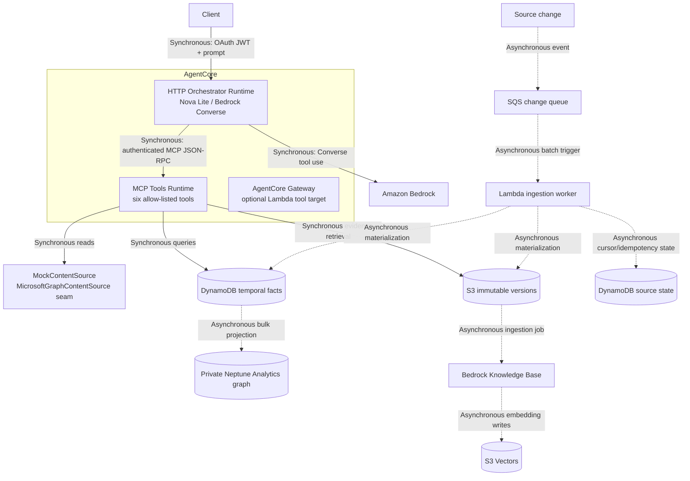
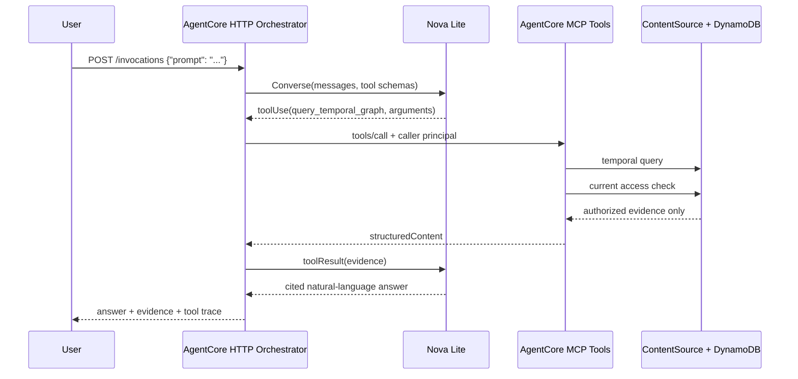

# SharePoint Temporal Query Agent — Design

Status: implemented vertical slice with deployed AWS infrastructure  
Last updated: 2026-09-10  
Source system status: SharePoint and Microsoft Graph are mocked

## 1. Purpose

This system answers natural-language questions about current and historical
SharePoint content while preserving evidence lineage and enforcing current
access policy.

Representative questions include:

- Who owned Atlas on 2024-02-01?
- What changed about Atlas between two dates?
- Which retention policy was effective on a given date?
- What conflicting claims existed, and which source versions support them?

The design separates conversational reasoning from evidence retrieval. The
model cannot issue arbitrary graph queries and can access data only through six
structured MCP tools.

## 2. Goals

- Accept natural-language temporal questions.
- Model both business-effective time and system-recorded time.
- Preserve immutable source versions, provenance, conflicts, and tombstones.
- Support late and out-of-order change events.
- Return evidence-rich answers with source artifact, source version, validity
  interval, and citation.
- Enforce the rule that historical evidence is returned only when the caller
  currently has access to the source document.
- Keep the source connector replaceable so Microsoft Graph can replace the mock.
- Preserve deployable boundaries for AgentCore Runtime and Gateway, SQS, S3,
  DynamoDB, Neptune Analytics, Bedrock Knowledge Bases, and S3 Vectors.

## 3. Non-goals

- Production Microsoft Graph or Entra ID integration.
- A general-purpose graph-query interface.
- Reconstructing evidence that is no longer authorized.
- Treating SharePoint modification time as business-effective time.
- Making the language model the system of record.

## 4. Architecture



Solid arrows represent the synchronous request/response query path. Dashed
arrows represent asynchronous ingestion, projection, and indexing.

### 4.1 Runtime separation

The project uses two AgentCore runtimes:

| Runtime | Protocol | Responsibility |
|---|---|---|
| `sharepoint_temporal_orchestrator` | HTTP, port 8080 | Accept natural language, run Nova Lite, select tools, synthesize answers |
| `sharepoint_temporal_tools` | MCP, port 8000 | Execute structured retrieval and authorization operations |

The orchestrator does not load DynamoDB temporal data directly. It calls the
MCP runtime through `RemoteMCPTools`, using a short-lived Cognito
client-credentials token.

The MCP runtime does not run a conversational model and does not expose
`ask_temporal`.

## 5. Request flow

### 5.1 Natural-language query



The model is used for interpretation, tool selection, and answer synthesis.
Temporal facts and access decisions come exclusively from tools.

### 5.2 Change ingestion

1. A source adapter emits a change with a stable event ID, source version ID,
   and recorded timestamp.
2. The event enters SQS.
3. Lambda conditionally records the event in the source-state table.
4. The exact immutable source version is read from S3.
5. Extracted claims are materialized in DynamoDB.
6. Graph projection data can be bulk imported into private Neptune Analytics.
7. Current document content is ingested into the Bedrock Knowledge Base and
   S3 Vector index.

The demo seeds an authoritative temporal projection from fixtures. See
“Known limitations” for the current incremental interval-repair gap.

### 5.3 Processing modes

The system deliberately separates query latency from ingestion latency.

| Operation | Mode | Completion semantics |
|---|---|---|
| Natural-language query | Synchronous | The HTTP response waits for model and MCP tool results |
| MCP tool call | Synchronous | Returns data already materialized in the query stores |
| Source change delivery | Asynchronous | Change is accepted into SQS for later processing |
| SQS to Lambda ingestion | Asynchronous | At-least-once delivery with event-ID idempotency |
| S3 immutable version archival | Asynchronous | Performed by the ingestion worker |
| DynamoDB temporal materialization | Asynchronous | Performed by the ingestion worker/materializer |
| Neptune graph projection | Asynchronous | Bulk import task completes independently |
| Knowledge Base indexing | Asynchronous | Bedrock ingestion job embeds and indexes documents |
| S3 Vector updates | Asynchronous | Written as part of Knowledge Base ingestion |
| Initial fixture bootstrap | Synchronous command | `seed_aws.py` waits for its direct uploads and writes |
| Local fixture replay | Synchronous in-process | Intended for deterministic development and tests |

The query path never waits for an SQS event, Neptune import, or Knowledge Base
ingestion job to finish. It reads the latest successfully materialized state.
This means source-to-query freshness is eventually consistent and should be
measured as ingestion lag in production.

## 6. Source abstraction

`ContentSource` is the connector boundary:

```text
changes(cursor)
list_versions(document_id)
get_version(document_id, version_id)
get_current(document_id)
search_current(query, principal)
check_access(document_id, principal)
```

Implementations:

- `MockContentSource`: fixture-backed and currently active.
- `MicrosoftGraphContentSource`: interface stub for Graph delta, DriveItem
  versions, exact version content, and current authorization.

The rest of the system depends on `ContentSource`, not Microsoft Graph types.

## 7. MCP tool contract

The MCP runtime exposes exactly these tools:

| Tool | Purpose |
|---|---|
| `search_sharepoint_current` | Search currently accessible source content |
| `resolve_entity` | Resolve a business entity name |
| `query_temporal_graph` | Query allow-listed temporal facts by structured fields |
| `retrieve_version_evidence` | Retrieve one exact source version |
| `compare_document_versions` | Produce an exact-version content diff |
| `check_access` | Evaluate current source access |

There is no Cypher, Gremlin, SPARQL, SQL, or arbitrary graph-query tool.

The orchestrator receives these schemas through `RemoteMCPTools` and presents
them to Bedrock Converse. It normalizes a small set of model-produced aliases,
such as `owned` to `owner`, before invoking MCP.

## 8. Temporal data model

Each `TemporalRecord` contains:

| Field | Meaning |
|---|---|
| `entity` | Business entity the claim concerns |
| `relationship` | Allow-listed claim type |
| `value` | Claim value |
| `valid_from`, `valid_to` | Business-effective interval |
| `recorded_from`, `recorded_to` | Interval during which the system knew the claim |
| `document_id`, `version_id` | Immutable source identity |
| `source_path` | Source artifact location |
| `citation` | Stable evidence URI |
| `provenance` | Source and extraction lineage |
| `tombstone` | Deletion marker |

Intervals are half-open:

```text
valid_from <= query_time < valid_to
recorded_from <= observation_time < recorded_to
```

### 8.1 Bitemporal semantics

- Valid time answers when a claim was true or effective in the business domain.
- Recorded time answers when the system observed the claim.
- A policy modified in February but effective in April has a February
  `recorded_from` and April `valid_from`.
- A late event can have an old `valid_from` and a newer `recorded_from`.
- Conflicting claims with the same valid-time start remain separate evidence
  records instead of being silently reconciled.

### 8.2 DynamoDB representation

Temporal facts use:

```text
pk = ENTITY#{entity}
sk = REL#{relationship}#VALID#{valid_from}#REC#{recorded_from}#{record_id}
```

A secondary index supports document and valid-time access:

```text
document_id + valid_from
```

The source-state table stores event idempotency records and future durable
cursor state.

### 8.3 Neptune representation

The graph projection contains:

- `Entity` vertices
- `Document` vertices
- `Version` vertices
- `HAS_VERSION` edges
- relationship edges carrying temporal and tombstone properties

Neptune is private and is not directly exposed to the model or clients.

## 9. Authorization model

The central policy is:

> Historical evidence may be returned only if the caller currently has access
> to the source document.

Enforcement occurs in the MCP tools runtime:

1. Query candidate temporal records.
2. Resolve each candidate’s source document.
3. Call `ContentSource.check_access` against the current source version.
4. Remove unauthorized evidence before returning structured results.
5. Deny exact-version retrieval and version comparison when current access is
   absent.

Runtime and Gateway ingress are protected with Cognito JWTs. Runtime-to-runtime
MCP calls use OAuth client credentials and cached short-lived tokens.

Production identity must replace the demo identity mechanism with Entra ID
subject and group IDs. Caller-supplied identity headers must not be trusted at
an internet-facing boundary.

## 10. Evidence and answer requirements

Every material answer should include:

- entity
- relationship
- value or claim
- valid interval
- source artifact
- source version
- citation
- conflict status when applicable

The orchestrator system prompt instructs the model not to invent facts,
citations, authorization decisions, dates, or graph queries. Tool results are
the sole grounding source.

The response includes:

```json
{
  "answer": "natural-language response",
  "evidence": [],
  "tool_trace": [],
  "model_id": "amazon.nova-lite-v1:0"
}
```

## 11. Current search and vector retrieval

Current source documents are archived under:

```text
s3://.../knowledge-base/current/
```

The Bedrock Knowledge Base uses Titan Text Embeddings v2 with a 1024-dimensional
S3 Vector index. This supports current-content semantic retrieval.

Temporal truth remains in the bitemporal store. Vector retrieval is not used to
infer historical validity intervals.

## 12. Deployment

Core infrastructure is declared in `infra/core.yaml`. `infra/deploy.sh`:

1. Deploys S3, SQS, DynamoDB, ECR, IAM, Cognito, and CodeBuild resources.
2. Builds separate `tools` and `orchestrator` ARM64 images.
3. Seeds S3, DynamoDB, and SQS with mock data.
4. Creates S3 Vectors, Neptune Analytics, and the Knowledge Base.
5. Creates the MCP tools runtime.
6. Creates the HTTP orchestrator runtime referencing the tools runtime ARN.

Data-bearing resources use retention policies. Neptune deletion protection is
enabled. Cleanup is intentionally explicit.

## 13. Observability

Available signals:

- AgentCore runtime status and CloudWatch runtime logs
- Bedrock model and tool trace returned by the orchestrator
- CodeBuild logs for image builds
- Lambda logs and SQS queue depth for ingestion
- DynamoDB source-state count for idempotency
- Knowledge Base ingestion-job statistics
- Neptune import-task status

Production additions should include:

- structured correlation IDs across both runtimes
- model latency and token metrics
- per-tool latency/error/access-filter counts
- ingestion lag and delta-cursor age
- denied historical evidence metrics without document details
- alarms for DLQ depth and failed Knowledge Base ingestion

## 14. Failure handling

| Failure | Behavior |
|---|---|
| Duplicate change event | Source-state conditional write makes it idempotent |
| Out-of-order event | Temporal materializer repairs valid-time ordering |
| Deleted source | Tombstone retained; current access fails closed |
| Permission removed | Historical evidence is filtered immediately |
| Bedrock tool error | Error is returned to the model as a failed tool result |
| Model exceeds tool turns | Orchestrator fails after six turns |
| MCP unavailable | Orchestrator returns a tool failure rather than bypassing MCP |
| Knowledge Base unavailable | Temporal graph tools remain authoritative |
| Neptune unavailable | DynamoDB temporal query path remains available |

## 15. Testing

The test suite covers:

- as-of ownership
- changes between dates
- evidence lineage
- current-access enforcement
- late and out-of-order ingestion
- deletion and tombstones
- conflicting claims
- exact-version comparison
- MCP allow-list enforcement
- natural-language fallback
- Bedrock tool-selection loop

Run:

```bash
python3 -m unittest discover -v
```

AWS smoke test:

```bash
python3 scripts/ask_aws.py "Who owned Atlas on 2024-02-01?"
```

## 16. Known limitations

1. **SharePoint is mocked.** No Graph delta tokens, webhooks, DriveItem version
   downloads, or Entra ID authorization are implemented.
2. **Demo identity propagation is not production-grade.** The local HTTP server
   defaults to `alice`, and runtime-to-runtime principal forwarding currently
   uses headers. Production must derive identity from verified JWT claims and
   pass a signed or platform-provided identity context.
3. **Incremental interval repair is incomplete in Lambda.** The deployed Lambda
   worker performs idempotent insert-only fact writes. The authoritative fixture
   replay/materializer repairs valid-time intervals, but production ingestion
   needs transactional interval closing and recorded-time correction logic.
4. **Recorded-time querying is modeled but not exposed as a public tool
   parameter.** The current tool supports valid-time and changed-between queries.
5. **The Gateway Lambda target is auxiliary.** The primary supported query path
   is HTTP orchestrator to MCP tools runtime.
6. **Extraction is fixture-provided.** Production requires a versioned claim
   extraction pipeline and provenance for extraction model/prompt versions.
7. **No multi-tenant isolation model is implemented.**

## 17. Production completion plan

### Phase 1: Microsoft identity and source

- Validate Entra ID JWTs.
- Map immutable user and group object IDs to `Principal`.
- Implement Graph delta cursor persistence and webhook renewal.
- Implement exact DriveItem version retrieval and immutable S3 archival.
- Evaluate current SharePoint permissions through Graph.

### Phase 2: durable temporal ingestion

- Move interval repair into a transactional DynamoDB materializer.
- Close superseded `valid_to` and `recorded_to` intervals.
- Add replay checkpoints, poison-event handling, and reprocessing controls.
- Rebuild Neptune projection from the authoritative DynamoDB/S3 history.

### Phase 3: operational hardening

- Separate IAM roles for orchestrator, MCP tools, ingestion, Gateway, and build.
- Use private networking or controlled egress where supported.
- Add distributed tracing, alarms, budgets, and retention policies.
- Add load, adversarial authorization, and model-evaluation suites.
- Add blue/green AgentCore runtime versions and rollback automation.

## 18. Key source files

| Area | File |
|---|---|
| Bedrock orchestrator | `temporal_agent/bedrock_agent.py` |
| Runtime-to-runtime MCP client | `temporal_agent/remote_mcp.py` |
| Structured tools and policy | `temporal_agent/tools.py` |
| MCP JSON-RPC service | `temporal_agent/mcp.py` |
| Runtime HTTP server | `temporal_agent/server.py` |
| Content-source boundary | `temporal_agent/source.py` |
| Bitemporal model | `temporal_agent/models.py` |
| Temporal materializer | `temporal_agent/store.py` |
| AWS-backed projection | `temporal_agent/aws_backend.py` |
| Lambda handlers | `aws_lambda/handlers.py` |
| Infrastructure | `infra/core.yaml`, `infra/deploy.sh` |
| Fixtures | `fixtures/repository.json`, `fixtures/changes.jsonl` |
