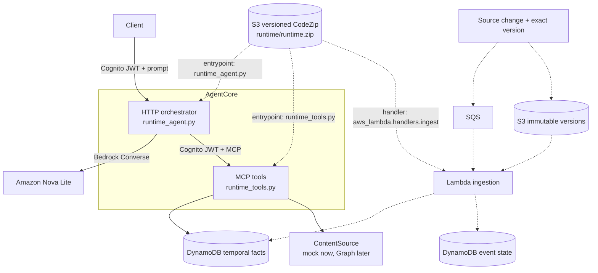
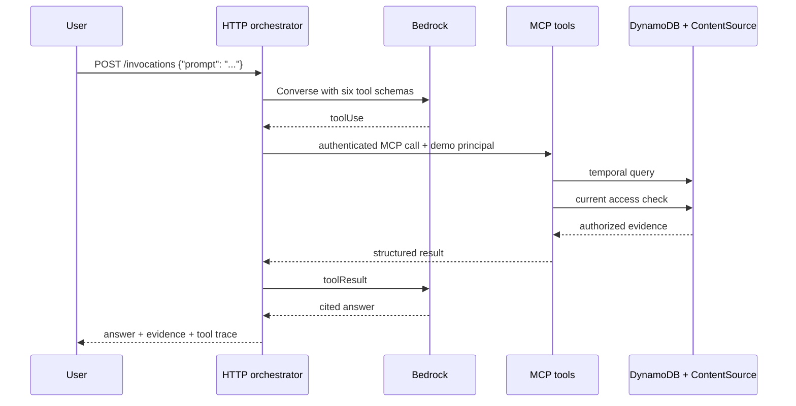

# SharePoint Temporal Query Agent — Design

Status: implemented local vertical slice and AWS deployment boundary
Last updated: 2026-09-10
Source status: SharePoint and Microsoft Graph are mocked

## 1. Purpose

The application answers natural-language questions about current and historical
SharePoint content while preserving source lineage and enforcing current access.

Examples:

- Who owned Atlas on 2024-02-01?
- What changed about Atlas between two dates?
- Which policy was effective on a given date?
- Which conflicting claims and source versions support an answer?

The language model interprets questions and synthesizes responses. Structured
tools remain authoritative for facts and access decisions.

## 2. Current scope

Implemented:

- local deterministic demo
- Bedrock-powered AgentCore orchestrator
- separate MCP tools runtime
- mock current search, exact versions, delta events and authorization
- bitemporal facts, tombstones, provenance and citations
- SQS/Lambda ingestion with event idempotency
- DynamoDB and S3 persistence boundaries
- Cognito workload authentication

Not implemented:

- Microsoft Graph connectivity
- Entra end-user authentication
- transactional interval repair in Lambda
- arbitrary graph querying
- multi-hop relationship questions

## 3. Architecture



Solid arrows are synchronous. Dashed arrows are asynchronous.

### 3.1 Runtime separation

| Runtime | Protocol | Responsibility |
|---|---|---|
| `sharepoint_temporal_orchestrator` | HTTP `/invocations` | CodeZip prompt interpretation, Bedrock tool loop, cited answer |
| `sharepoint_temporal_tools` | MCP `/mcp` | CodeZip temporal retrieval and access filtering |

Both runtimes use the same immutable, versioned CodeZip artifact from S3. The
runtime configuration selects `runtime_agent.py` for HTTP and
`runtime_tools.py` for MCP. The MCP process still satisfies the AgentCore
contract by listening on `0.0.0.0:8000/mcp`. No container build is required.

### 3.2 Shared artifact boundary

| Consumer | Artifact configuration |
|---|---|
| HTTP orchestrator | `codeConfiguration`, Python 3.13, entrypoint `runtime_agent.py` |
| MCP tools runtime | `codeConfiguration`, Python 3.13, entrypoint `runtime_tools.py` |
| Lambda ingestion | Same S3 object/version, handler `aws_lambda.handlers.ingest` |

The versioned S3 object is the deployment unit. Runtime configuration, rather
than a separate image, selects the executable boundary. The package includes
Linux ARM64 dependencies so it is reproducible when built from macOS or another
developer platform.

## 4. Query flow



The orchestrator never reads DynamoDB directly. The MCP runtime never runs a
conversational model.

## 5. Ingestion flow

1. The source emits a stable event ID, source version ID and recorded timestamp.
2. SQS delivers the event to Lambda at least once.
3. Lambda conditionally records `EVENT#{event_id}` in the source-state table.
4. Lambda reads the exact immutable version from S3.
5. Extracted claims are inserted into the temporal-facts table.
6. Duplicate events and duplicate fact keys are ignored.

The deployed worker repairs valid-time ordering after each insert and runs with
one reserved concurrent execution for deterministic fixture replay. Production
ingestion must make those repairs transactional and close superseded
`recorded_to` intervals. The local materializer uses the same valid-time
semantics for deterministic testing.

Queries read the latest completed DynamoDB state and do not wait for ingestion.

## 6. Source abstraction

`ContentSource` defines:

```text
changes(cursor)
list_versions(document_id)
get_version(document_id, version_id)
get_current(document_id)
search_current(query, principal)
check_access(document_id, principal)
```

Implementations:

- `MockContentSource`: active fixture-backed implementation.
- `MicrosoftGraphContentSource`: production seam for Graph delta, DriveItem
  versions, exact content and current permissions.

No Microsoft Graph type leaks beyond this boundary.

## 7. MCP contract

The tools runtime exposes exactly:

| Tool | Purpose |
|---|---|
| `search_sharepoint_current` | Search currently accessible source content |
| `resolve_entity` | Resolve an accessible business entity |
| `query_temporal_graph` | Query allow-listed temporal relationships |
| `retrieve_version_evidence` | Retrieve one exact authorized version |
| `compare_document_versions` | Compare two exact authorized versions |
| `check_access` | Evaluate current source access |

There is no raw SQL, Cypher, Gremlin or SPARQL tool.

## 8. Bitemporal model

Each temporal fact contains:

```text
entity
relationship
value
valid_from / valid_to
recorded_from / recorded_to
document_id / version_id
source_path
citation
provenance
tombstone
```

Intervals are half-open:

```text
valid_from <= query_time < valid_to
recorded_from <= observation_time < recorded_to
```

- Valid time answers when a claim was effective in the business domain.
- Recorded time answers when the system learned the claim.
- Conflicting claims with the same valid start remain separate evidence.
- Deletion creates a tombstone and current access fails closed.

### 8.1 DynamoDB representation

```text
pk = ENTITY#{entity}
sk = REL#{relationship}#VALID#{valid_from}#REC#{recorded_from}#{record_id}
```

The current AWS adapter refreshes its small demo projection with a table scan
before a query. Production should replace this with targeted `Query` operations
and appropriate indexes.

## 9. Authorization

Central policy:

> Historical evidence may be returned only when the caller currently has
> access to the source document.

For every candidate record, MCP calls `ContentSource.check_access` against the
current source state before returning evidence. Exact-version retrieval and
comparison use the same policy.

### 9.1 Current authentication assumption

Cognito currently provides workload authentication:

```text
demo client --client credentials--> orchestrator
orchestrator --client credentials--> MCP
```

The demo principal travels through explicitly allow-listed AgentCore custom
headers. This is not end-user authentication.

### 9.2 Production identity path

1. Validate an Entra ID user token at ingress.
2. Derive immutable user and group object IDs from verified claims.
3. Create `Principal` only from that verified identity.
4. Pass a signed or platform-protected user context to MCP.
5. Evaluate current SharePoint permissions through Microsoft Graph.

Caller-controlled principal headers must be rejected in production.

## 10. Deployment

`infra/core.yaml` provisions:

- S3 artifact and immutable-version bucket
- SQS change queue and DLQ
- DynamoDB temporal-facts and source-state tables
- AgentCore runtime role
- Lambda ingestion role
- Cognito resource server and machine client

`infra/deploy.sh` then:

1. packages both runtime entry points and Lambda dependencies into one CodeZip
2. uploads the immutable artifact to versioned S3
3. creates or updates the Lambda ingestion worker and SQS mapping
4. archives and seeds fixtures
5. creates or updates the HTTP and MCP CodeZip runtimes

Both AgentCore runtimes and Lambda share the same versioned S3 code artifact.
The packaging step resolves binary dependencies for Linux ARM64/Python 3.13 and
does not embed host-specific wheels.

### 10.1 Migration from the container deployment

Updating an existing stack removes the obsolete CodeBuild project and all ECR
permissions from the runtime role. The former ECR repository had a retain
policy, so CloudFormation can leave it behind as an unused resource. Delete it
only after both AgentCore runtimes report a CodeZip `codeConfiguration` and the
orchestrator-to-MCP path has been tested.

## 11. Optional future Neptune path

Neptune is disabled by default and is not queried by the current application.
Its future purpose is bounded multi-hop traversal across relationships such as:

```text
application OWNED_BY team
team REPORTS_TO organization
application DEPENDS_ON system
policy APPLIES_TO system
supplier PROVIDES system
```

Representative questions:

- Which applications owned by teams under Finance depend on systems affected
  by a policy on a given date?
- Which downstream systems were exposed when a supplier's risk changed?
- Through which evidence-backed path was an application connected to a deleted
  procedure?

The future MCP tool is proposed as:

```text
query_relationship_paths(
  start_entity,
  target_type,
  relationship_types,
  direction,
  as_of,
  max_hops,  # capped, initially 3
  limit      # capped
)
```

The service will compile these structured fields to parameterized OpenCypher,
enforce relationship allow-lists and timeouts, and apply current-access checks
to every evidence-bearing path segment. Raw Cypher will never cross the MCP
boundary.

DynamoDB and S3 remain authoritative. Neptune is disposable and rebuildable.

## 12. Deliberate removals

The holistic review removed components that had no current consumer:

- the duplicate orchestrator and generic Dockerfiles
- the remaining MCP Dockerfile, ECR repository and CodeBuild project after
  selecting AgentCore CodeZip for both runtimes
- Bedrock Knowledge Base and S3 Vectors
- AgentCore Gateway claims and the unused Gateway Lambda handler
- the hidden `ask_temporal` pseudo-tool
- Neptune seeding scripts that projected no useful multi-hop ontology

These can return only when backed by a concrete tool and tested request path.

## 13. Failure behavior

| Failure | Behavior |
|---|---|
| Duplicate source event | Source-state conditional write skips it |
| Out-of-order local event | Materializer repairs valid-time ordering |
| Deleted source | Tombstone retained; access fails closed |
| Permission removed | Historical evidence is filtered immediately |
| MCP unavailable | Orchestrator fails rather than bypassing tools |
| Bedrock tool error | Error is returned to the model as a failed tool result |
| Optional Neptune unavailable | Current direct temporal questions are unaffected |

## 14. Tests

The suite covers:

- as-of queries and changes between dates
- policy effective date versus modification date
- lineage and citations
- current-access enforcement
- late and out-of-order events
- conflicting claims
- deletion and tombstones
- exact-version comparison
- MCP allow-list enforcement
- natural-language orchestration
- Bedrock tool selection

Run:

```bash
python3 -m unittest discover -v
```

## 15. Production completion path

### Phase 1: Microsoft identity and source

- implement `MicrosoftGraphContentSource`
- validate Entra JWTs and group claims
- persist Graph delta cursors and subscriptions
- retrieve exact DriveItem versions and current permissions

### Phase 2: durable temporal ingestion

- transactionally repair valid and recorded intervals
- add replay checkpoints and poison-event controls
- replace table scans with targeted DynamoDB queries

### Phase 3: optional multi-hop graph queries

- define and version the relationship ontology
- build a rebuildable Neptune projection
- implement bounded `query_relationship_paths`
- test authorization, cycles, deleted evidence and projection lag

### Phase 4: operations

- split runtime roles by responsibility if required
- add tracing, ingestion-lag alarms and token metrics
- add load and adversarial authorization suites
- add deployment rollback automation
