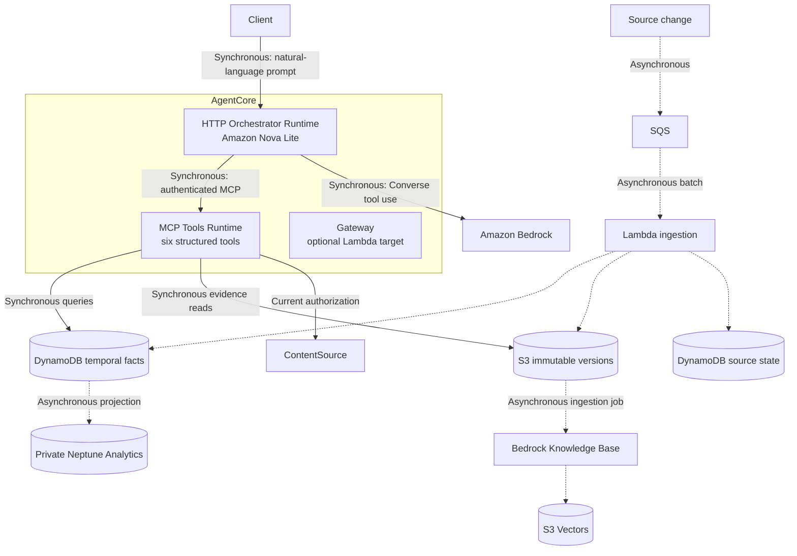

# SharePoint Temporal Query Agent

A local and AWS-deployed vertical slice for asking natural-language questions
about current and historical SharePoint-like content.

SharePoint and Microsoft Graph are currently mocked. The remainder of the
architecture uses real AWS services and preserves a swappable `ContentSource`
boundary for the future Graph connector.

## Architecture



Solid arrows are synchronous query operations. Dashed arrows are asynchronous
ingestion, projection, and indexing.

### AgentCore runtimes

The conversational and evidence boundaries are deployed independently:

| Runtime | Protocol | Responsibility |
|---|---|---|
| `sharepoint_temporal_orchestrator` | HTTP `/invocations`, port 8080 | Interpret natural language, select tools with Nova Lite, synthesize cited answers |
| `sharepoint_temporal_tools` | MCP `/mcp`, port 8000 | Execute structured retrieval and authorization operations |

The orchestrator calls tools only through the authenticated MCP runtime. It does
not load the temporal database directly. The tools runtime does not run a model.

## Core behavior

- Bitemporal facts use `valid_from`, `valid_to`, `recorded_from`, and
  `recorded_to`.
- Immutable source versions carry source IDs, provenance, and citations.
- Late and out-of-order events preserve their observation time.
- Conflicting claims remain separate evidence instead of being silently merged.
- Deletions produce tombstones.
- Historical evidence is returned only when the caller currently has access to
  the source document.
- No arbitrary Cypher, Gremlin, SPARQL, SQL, or graph-query tool is exposed.

## MCP tools

The tools runtime exposes exactly:

- `search_sharepoint_current`
- `resolve_entity`
- `query_temporal_graph`
- `retrieve_version_evidence`
- `compare_document_versions`
- `check_access`

Amazon Nova Lite receives these tool schemas through Bedrock Converse. Tool
results are the grounding source for the final answer.

## Run locally

Requirements:

- Python 3.11 or newer
- No third-party packages for local fixture mode

Run the tests:

```bash
python3 -m unittest discover -v
```

Ask a local question:

```bash
python3 -m temporal_agent.cli ask \
  "Who was owner of Atlas as of 2024-02-01?"
```

Start the combined local development server:

```bash
python3 -m temporal_agent.cli serve --port 8080
```

The local server is a development convenience. AWS uses the two separate
runtime images in `Dockerfile.agent` and `Dockerfile.tools`.

## Run the AWS demo

The demo command discovers physical resource identifiers from CloudFormation
and AgentCore APIs. No account IDs, runtime IDs, Cognito IDs, or token URLs are
hardcoded in the repository.

```bash
python3 scripts/ask_aws.py \
  --profile default \
  --region <region> \
  "Who owned Atlas on 2024-02-01?"
```

Example questions:

```text
Who owned Atlas on 2024-04-01?
What changed about Atlas between 2024-02-01 and 2024-04-01?
What was the retention policy about Customer Records on 2024-04-02?
What was the risk about Atlas on 2024-03-01?
What was the exception status about Atlas on 2024-06-05?
Who owned Orion on 2024-02-01?
```

The helper:

1. Reads CloudFormation outputs.
2. Locates the HTTP orchestrator by logical runtime name.
3. Obtains a short-lived Cognito token without printing the client secret.
4. Sends the natural-language prompt to AgentCore.
5. Prints the evidence-grounded answer.

## Ingestion model

Production change ingestion is asynchronous:

```text
source change → SQS → Lambda → S3/DynamoDB
```

Also asynchronous:

- Neptune graph bulk projection
- Bedrock Knowledge Base ingestion
- S3 Vector embedding writes

Synchronous exceptions:

- initial fixture bootstrap with `scripts/seed_aws.py`
- local in-process replay for tests
- queries against already materialized state

The query path is eventually consistent with the source and does not wait for
SQS, Neptune, or Knowledge Base jobs to complete.

## Fixtures

`fixtures/repository.json` contains exact source versions with:

- document and version IDs
- path and title
- modification and business-effective dates
- extracted claims
- current readers
- deletion status
- source provenance

`fixtures/changes.jsonl` is the replayable logical-clock event stream. It covers:

- ownership changes
- policy effective dates that differ from modification dates
- rename
- deletion
- late and out-of-order events
- conflicting claims
- permission changes

## Deploy

The infrastructure template and deployment script are:

- `infra/core.yaml`
- `infra/deploy.sh`

Deploy using your own profile and region:

```bash
AWS_PROFILE=<profile> AWS_REGION=<region> bash infra/deploy.sh
```

The deployment provisions:

- AgentCore HTTP orchestrator and MCP tools runtimes
- Cognito OAuth protection
- S3 evidence archive
- SQS and DLQ
- Lambda ingestion worker
- DynamoDB temporal and source-state tables
- private Neptune Analytics graph
- Bedrock Knowledge Base and S3 Vectors
- ECR and CodeBuild ARM64 image pipeline
- AgentCore Gateway boundary

Physical identifiers are intentionally omitted from source control. See
`DEPLOYED.md` for discovery commands.

## Security

- Both runtimes require Cognito JWTs.
- Runtime-to-runtime MCP calls use short-lived OAuth tokens.
- The model can call only allow-listed tools.
- Authorization occurs in the tools runtime before evidence is returned.
- S3 public access is blocked.
- S3 and SQS use server-side encryption.
- DynamoDB point-in-time recovery is enabled.
- Neptune has no public connectivity.
- Credentials and local secret files are excluded by `.gitignore`.

Do not trust caller-provided identity headers in production. Replace the demo
identity path with verified Entra ID claims and immutable user/group object IDs.

## Production gaps

- Implement `MicrosoftGraphContentSource`.
- Validate Entra ID tokens and expand current group membership.
- Persist and renew Graph delta cursors and subscriptions.
- Add transactional interval repair to incremental Lambda ingestion.
- Expose recorded-time querying where required.
- Version the claim-extraction model and include it in provenance.
- Separate IAM roles further by runtime and worker responsibility.
- Add tracing, ingestion-lag alarms, token metrics, budgets, and deployment
  rollback automation.

## Documentation

- `DESIGN.md`: detailed architecture and design decisions
- `DEPLOYED.md`: identifier-free deployment discovery guide
- `tests/test_vertical_slice.py`: behavioral coverage

## Cost and cleanup

Managed AWS services can incur ongoing charges, particularly Neptune Analytics,
AgentCore, Bedrock, and vector ingestion. Data resources use retention policies,
and Neptune deletion protection is enabled. Review `infra/destroy.sh` and remove
resources explicitly when the environment is no longer needed.
