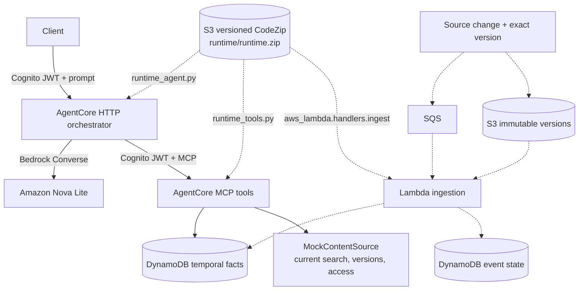

# SharePoint Temporal Query Agent

An AWS-deployed AgentCore application for natural-language questions about
current and historical SharePoint-like content. SharePoint and Microsoft Graph
are mocked behind a swappable `ContentSource` boundary.

## Architecture



The query path is synchronous. Source ingestion is asynchronous and eventually
consistent.

### Runtime boundaries

| Runtime | Entry point | Responsibility |
|---|---|---|
| `sharepoint_temporal_orchestrator` | `runtime_agent.py`, HTTP `/invocations` | CodeZip Python runtime for prompt interpretation and cited answers |
| `sharepoint_temporal_tools` | `runtime_tools.py`, MCP `/mcp` | CodeZip Python runtime for structured temporal retrieval and access checks |

Both runtimes reference the same immutable, versioned CodeZip artifact in S3
and select different entry points. The MCP process listens on
`0.0.0.0:8000/mcp`; the HTTP orchestrator listens on
`0.0.0.0:8080/invocations`. Docker, ECR and CodeBuild are not required.

The ZIP contains application code, fixtures, Lambda code and Linux ARM64
dependencies. AgentCore starts the selected entrypoint; Lambda uses the handler
from the same artifact.

Natural-language requests always use Amazon Bedrock. There is no deterministic
planner, combined local server, or local `ask` command. If Bedrock or the MCP
runtime is unavailable, the request fails instead of switching to a local
fallback.

## Temporal and security behavior

- Facts carry `valid_from`, `valid_to`, `recorded_from`, and `recorded_to`.
- Source versions are immutable and include provenance and stable citations.
- Late and out-of-order events preserve their recorded time.
- Conflicting claims remain separate evidence.
- Deletions produce tombstones.
- Historical evidence is returned only when the caller currently has access to
  the source document.
- No arbitrary SQL, Cypher, Gremlin or SPARQL query surface is exposed.

The MCP runtime exposes exactly six tools:

- `search_sharepoint_current`
- `resolve_entity`
- `query_temporal_graph`
- `retrieve_version_evidence`
- `compare_document_versions`
- `check_access`

## Verify before deployment

Requirements:

- Python 3.11 or newer
- Project dependencies installed with `python3 -m pip install -e .`

```bash
python3 -m unittest discover -v
```

The tests use fixtures and fake AWS/Bedrock boundaries to verify temporal
semantics without starting an application runtime. They are not a supported
local execution mode.

## Deploy to AWS

The deployment creates:

- AgentCore HTTP and MCP CodeZip runtimes
- Cognito machine-to-machine OAuth protection
- S3 immutable source and runtime artifacts
- DynamoDB temporal-fact and ingestion-state tables
- SQS, DLQ and a Lambda ingestion worker

Deploy:

```bash
AWS_PROFILE=<profile> AWS_REGION=<region> bash infra/deploy.sh
```

The script packages one CodeZip artifact containing both runtime entry points
and the Lambda handler, uploads it to versioned S3, deploys the Lambda worker,
seeds the fixtures, and creates or updates both AgentCore runtimes.
Dependencies are resolved for Linux ARM64/Python 3.13, so deployment packaging
does not depend on the developer workstation architecture.

For an environment previously deployed with the container design, updating the
stack removes the obsolete CodeBuild project. The old ECR repository may remain
because it was configured with `DeletionPolicy: Retain`; it is not used by the
CodeZip runtimes and can be removed separately after verification.

### Invoke the orchestrator

`scripts/ask_aws.py` is a convenience client, not the application entry point.
The application entry point is the orchestrator's `/invocations` endpoint.

```bash
python3 scripts/ask_aws.py \
  --profile <profile> \
  --region <region> \
  "Who owned Atlas on 2024-02-01?"
```

### Test prompts

| Prompt | Expected behavior |
|---|---|
| `Who owned Atlas on 2024-02-01?` | Alice, version 1.0 |
| `Who owned Atlas on 2024-04-01?` | Bob, version 2.0 |
| `What changed about Atlas between 2024-02-01 and 2024-04-01?` | Ownership change with evidence |
| `What was the retention policy about Customer Records on 2024-03-15?` | No effective policy |
| `What was the retention policy about Customer Records on 2024-04-02?` | Seven years, effective April 1 |
| `What was the risk about Atlas on 2024-03-01?` | Both conflicting risk claims |
| `What was the exception status about Atlas on 2024-03-01?` | Late-arriving `open` claim |
| `Who owned Orion on 2024-02-01?` | No evidence because current access was revoked |
| `Who was the owner of Legacy Approval as of 2024-02-01?` | No evidence because the source is deleted |
| `Who owned Phoenix on 2025-02-01?` | Dana, version 1.0 |
| `Who owned Phoenix on 2025-08-01?` | Erin, version 2.0 |
| `What changed about Phoenix between 2025-06-01 and 2025-08-01?` | Ownership transferred to Erin |
| `What was the retention policy about Phoenix Records on 2026-09-15?` | No effective policy yet |
| `What was the retention policy about Phoenix Records on 2026-10-02?` | Five years, effective October 1 |
| `What was the risk about Phoenix on 2025-04-01?` | Both Low and High conflicting assessments |

## Authentication assumption

Cognito currently authenticates workloads, not users:

```text
demo client --client-credentials JWT--> orchestrator
orchestrator --client-credentials JWT--> MCP tools
```

The demo principal is forwarded through AgentCore's allow-listed custom headers.
Production must derive the user and group IDs from a verified Entra ID JWT and
pass a signed or platform-protected identity context to MCP. Caller-provided
identity headers must not be trusted in production.

## Ingestion

`fixtures/changes.jsonl` is replayed through:

```text
source adapter → S3 exact version
              → SQS → Lambda → DynamoDB
```

The source-state table makes event handling idempotent. The deployed Lambda
repairs valid-time intervals after inserts. Production still needs transactional
updates and complete recorded-time interval closure.

Unit tests replay the same stream through a test-only in-memory store with a
controllable logical clock.

## Fixtures

`fixtures/repository.json` includes:

- ownership changes and rename
- policy effective dates different from modification dates
- deletion and tombstones
- late and out-of-order versions
- conflicting claims
- permission changes

`fixtures/changes.jsonl` contains stable event IDs and recorded timestamps.

## Optional future Neptune path

Neptune is not used by the current query path. Set `ENABLE_NEPTUNE=true` only
to provision a graph for future bounded multi-hop work:

```bash
ENABLE_NEPTUNE=true AWS_PROFILE=<profile> AWS_REGION=<region> \
  bash infra/deploy.sh
```

The planned tool accepts structured start entity, allow-listed relationships,
`as_of`, direction and a capped hop count. It will never accept raw Cypher.
DynamoDB and S3 remain authoritative; Neptune is a rebuildable projection. See
`DESIGN.md` for the proposed multi-hop model.

## Deliberate omissions

- Bedrock Knowledge Bases and S3 Vectors: no current tool consumed them.
- AgentCore Gateway: the application already has explicit orchestrator and MCP
  runtime boundaries.
- Docker, ECR and CodeBuild: both AgentCore runtimes use CodeZip.
- The combined local server, CLI `ask` command and deterministic parser:
  deployed natural-language requests always use Bedrock.
- Production Microsoft Graph and Entra integration: retained as interfaces and
  documented production work.

## Production work

- Implement `MicrosoftGraphContentSource`.
- Validate Entra JWTs and resolve immutable group membership.
- Persist Graph delta cursors and subscriptions.
- Perform transactional bitemporal interval repair during ingestion.
- Replace DynamoDB scans with targeted query access patterns.
- Version claim extraction and include model/prompt versions in provenance.
- Add tracing, ingestion-lag alarms and adversarial authorization tests.

## Key files

| Area | File |
|---|---|
| Orchestrator | `temporal_agent/orchestrator.py`, `temporal_agent/bedrock_agent.py` |
| MCP tools | `temporal_agent/mcp.py`, `temporal_agent/tools.py` |
| Source boundary | `temporal_agent/source.py` |
| Temporal model | `temporal_agent/models.py`, `temporal_agent/store.py` |
| AWS persistence | `temporal_agent/aws_backend.py` |
| Ingestion worker | `aws_lambda/handlers.py` |
| Deployment | `infra/core.yaml`, `infra/deploy.sh` |
| Detailed design | `DESIGN.md` |

## Cleanup

S3 and DynamoDB are retained when the CloudFormation stack is deleted. AgentCore
runtimes, the Lambda function and an optional Neptune graph are managed outside
the stack and must be removed explicitly. A legacy ECR repository from the
earlier container design may also require explicit removal.
